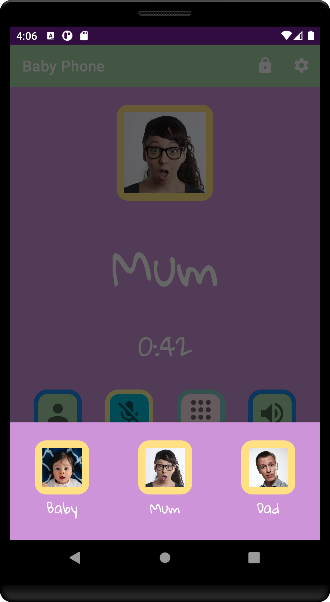
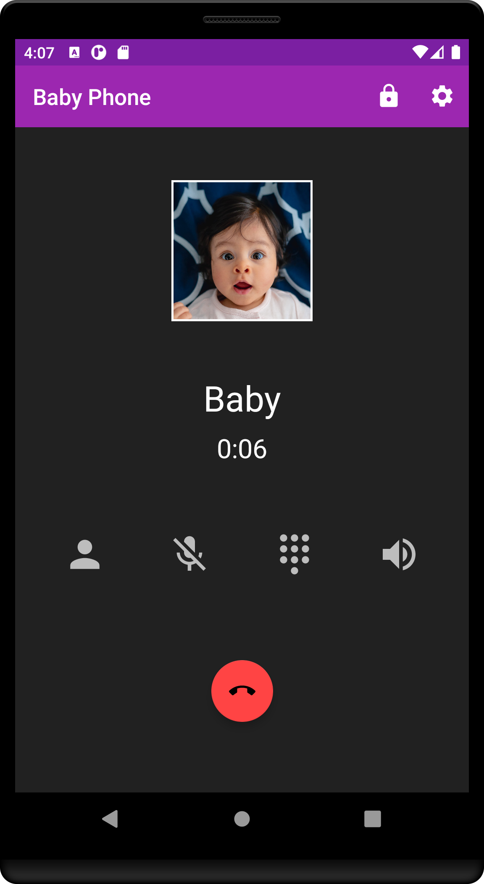
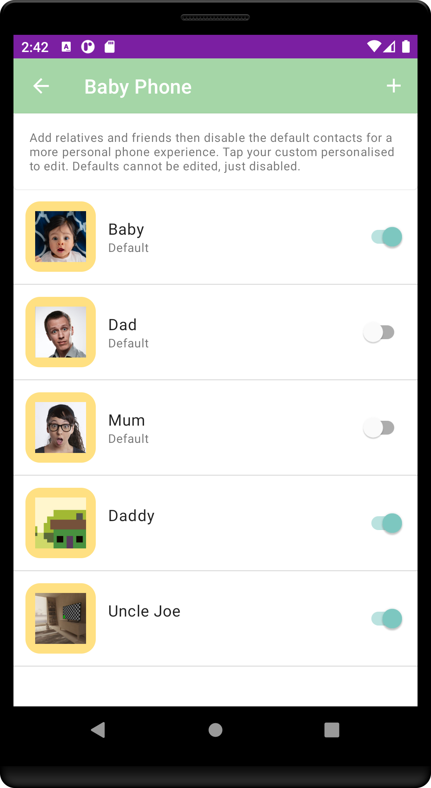

# Baby Phone

 

**A pretend phone app for little people who want to practice talking to others.**

   

Does your little one like to talk to family and friends on the phone? Do they get sad when there is nobody free to speak with them?

Install this pretend phone app to let them listen and speak to another toddler at the other end of the phone babbling back to them.

## Roadmap

Still in early stages of development. Some ideas for future improvements include:

* [Interactively listen to the microphone and only babble back when there is a period of silence](https://github.com/babydots/babyphone/issues/3).
* [Record your own audio so your little ones can hear loved ones from their real family](https://github.com/babydots/babyphone/issues/4).
* [Screen lock to prevent little fingers from unwittingy closing the app and accidentally causing trouble](https://github.com/babydots/babyphone/issues/5).

## Contributing

### Donations

Baby Phone is an open source, GPLv3 application. It will always be freely available via F-Droid, or for anyone to build, fork, or improve via the source code.

If you wish to support the development financially, you can do so via:

* [Liberapay](https://liberapay.com/BabyDots/donate)
* [GitHub sponsors](https://github.com/sponsors/pserwylo)

### Reporting Issues

Please report any issues or suggest features on the [issue tracker](https://github.com/babydots/babyphone/issues).

### Translating

We use [Weblate](https://hosted.weblate.org/engage/babyphone/) to manage translations. Please see [these instructions for using Weblate](https://hosted.weblate.org/engage/babyphone/) to translate BabyPhone.

| Android app                                                                                                                                          | F-Droid metadata                                                                                                                                  |
|------------------------------------------------------------------------------------------------------------------------------------------------------|---------------------------------------------------------------------------------------------------------------------------------------------------|
|  |  |

### Submitting changes

Pull requests will be warmly received at [https://github.com/babydots/babyphone](https://github.com/babydots/babyphone).

## Compiling

This app uses a typical `gradle` folder structure and is written in Kotlin.

 * To build (a debug version): `gradle assembleDebug`

Alternatively, you can import the project into Android Studio and build from there.

## License

This program is Free Software: You can use, study share and improve it at your will. Specifically you can redistribute and/or modify it under the terms of the [GNU General Public License](https://www.gnu.org/licenses/gpl.html) as published by the Free Software Foundation, either version 3 of the License, or (at your option) any later version.

### Attribution

* Photos:
  * [Baby photo adapted from Unsplash](https://unsplash.com/photos/tRSOnb_SBvk).
  * [Mum photo adapted from RobbinHiggins on pixabay](https://pixabay.com/photos/surprised-woman-young-portrait-3355958/) used under the [pixabay license](https://pixabay.com/service/license/).
  * [Dad photo adapted from Ludovic Migneault on Unsplash](https://unsplash.com/photos/5xbCj_VWKcs).
  * Icons, feature graphics, etc, created for this project.
* Audio:
  * Created specifically for this project.
* Fonts:
  * [Gloria Hallelujah font](https://fonts.google.com/specimen/Gloria+Hallelujah?category=Handwriting&preview.text=Baby&preview.text_type=custom#standard-styles): Open Font License
